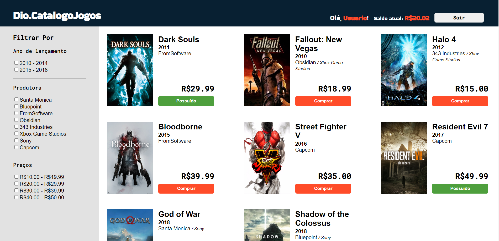

# Digital Innovation One - Prática ReactJs

## Criando um front-end componentizado de catálogo de jogos

Projeto desenvolvido durante o bootcamp TakeBlip Fullstack Developer #2 na plataforma DIO com o intuito de aplicar conceitos de ReactJs.
Consiste no Client da API RESTful desenvolvida no projeto [Dio.CatalogoJogos](https://github.com/schelip/Dio.CatalogoJogos).

O projeto permite à um usuário já cadastrado no banco de dados realizar sua autenticação, visualizar e filtrar os jogos cadastrados e realizar a "compra" de jogos.

Foram aplicados no projeto:
- Práticas de componentização
- Testes unitários utilizando `jest` e `msw/node`
- Aplicação de estilos utilizando `styled-components`
- Práticas do paradigma funcional utilizando Hooks

## Preview
Preview do projeto finalizado:
## 

## Rodando o projeto

Clone o projeto do back-end: [Dio.CatalogoJogos](https://github.com/schelip/Dio.CatalogoJogos)

Inicie a API e popule o banco de dados seguindo as instruções de [Dio.CatalogoJogos](https://github.com/schelip/Dio.CatalogoJogos)

O projeto utiliza [IMDb-API](https://imdb-api.com/) para carregar os posters dos jogos, sendo necessário fazer o cadastro para receber uma chave gratuita (100 solicitações diárias).

Clone o projeto do client e crie um arquivo `.env`, e copie o conteúdo de `sample.env`. Substitua o valor de `REACT_APP_API` com o URL do endpoint da API e de `REACT_APP_IMDB_KEY` com a sua chave. Caso a chave informada sejá inválida, o app funcionará normalmente, mas renderizará Placeholders no lugar dos Posters.

Inicializando o projeto com [Yarn](https://yarnpkg.com/):

### `$ yarn`
### `$ yarn start`

Caso o projeto não esteja sendo hosteado na porta padrão (:3000), é necessário alterar o valor contido no campo `Dio.CatalogoJogos.Api\appsettings.json\AllowedOrigins` para que o client seja considerado na política de CORS da API.

Caso a API ainda não esteja retornando dados, o seu browser pode estar bloqueando a API por falta de um certificado. Visite a URL com política https (https://localhost:5001, por padrão) e habilite o acesso.

Caso o banco de dados tenha sido populado seguindo com os dados de exemplo, foi cadastrado um usuário de exemplo com email _user@example.com_ e senha _string_.

## Créditos da mentoria:

Matheus Benites: https://linkedin.com/in/omatheusbenites
